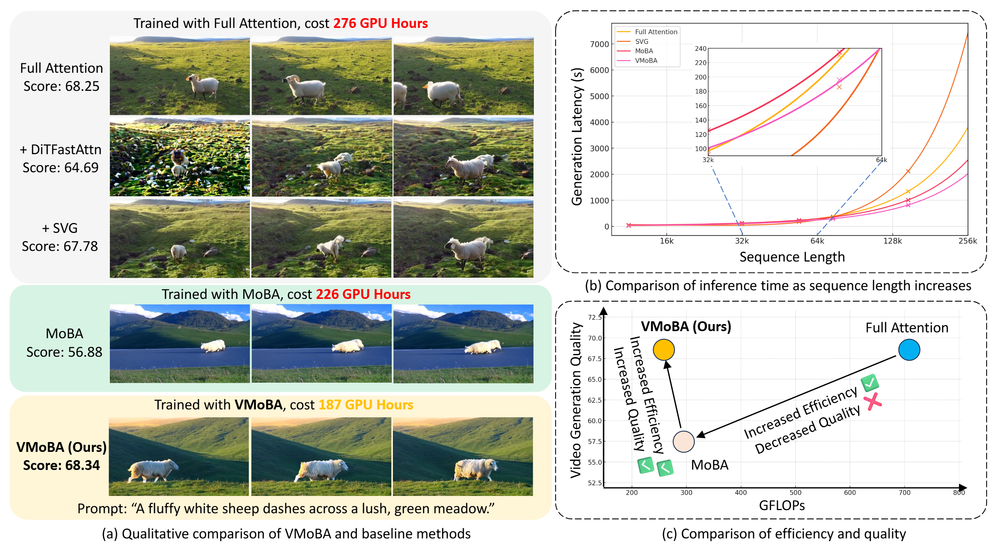
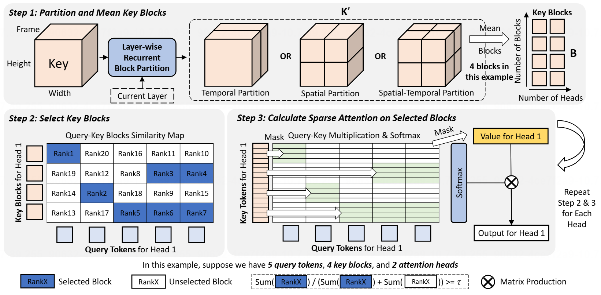

<br />
<p align="center">
  <h1 align="center">VMoBA: Mixture-of-Block Attention for <br> Video Diffusion Models</h1>
  <p align="center">
    <br />
    <a href="https://jianzongwu.github.io/"><strong>Jianzong Wu</strong></a>
    ·
    <a href="https://liang-hou.github.io/"><strong>Liang Hou</strong></a>
    ·
    <a href="https://yanght321.github.io/"><strong>Haotian Yang</strong></a>
    ·
    <a href="https://www.xtao.website/"><strong>Xin Tao</strong></a>
    .
    <a href="https://tyfeld.github.io/"><strong>Ye Tian</strong></a>
    .
    <a href="https://scholar.google.com/citations?user=P6MraaYAAAAJ&hl=en"><strong>Pengfei Wan</strong></a>
    ·
    <a href="https://ieeexplore.ieee.org/author/922173984202299"><strong>Di Zhang</strong></a>
    ·
    <a href="https://scholar.google.com/citations?user=T4gqdPkAAAAJ"><strong>Yunhai Tong</strong></a>
  </p>

  <p align="center">
    <a href='TODO'>
      
    </a>
  </p>
<br />



## 🚀 TL;DR

We introduce **VMoBA**, Mixture of Block Attention for Video Diffusion Models!

- 🌟 Sparse attention mechanism based on MoBA, designed for video diffusion model **training**.
- 🖼️ Key innovations: Layer-wise Recurrent Block Partition, Global Block Selection, and Threshold-based Block Selection. These innovations enhance VMoBA's performance and speed in video generation.
- ✨ 2.92x FLOPs acceleration. 1.48x latency acceleration on 576p video (93x576x1024, 55K tokens). Faster with longer sequence length!




## 🎉 News

- [2025-6-27] Paper and code are released!

## 🛠️ Quick Start

We provide a **clean single-file code** with only VMoBA implemented by FlashAttention, along with its speed test unit. Feel free to replace Full Attention with VMoBA in any of your models!

### Environment Preparation

``` bash
# Create a new environment with Conda
conda create -n diffusers python=3.11
conda activate diffusers

# Install Pytorch
conda install pytorch==2.4.1 torchvision==0.19.1 torchaudio==2.4.1 pytorch-cuda=12.1 -c pytorch -c nvidia

## Install FlashAttention locally
pip install packaging ninja
mkdir libs
cd libs
wget https://github.com/Dao-AILab/flash-attention/releases/download/v2.6.3/flash_attn-2.6.3+cu123torch2.4cxx11abiTRUE-cp311-cp311-linux_x86_64.whl
pip install flash_attn-2.6.3+cu123torch2.4cxx11abiTRUE-cp311-cp311-linux_x86_64.whl

## Install other dependencies
pip install -r requirements.txt
```

For issues installing FlashAttention, please refer to the [official repo](https://github.com/Dao-AILab/flash-attention) for help.


### VMoBA Speed Test

VMoBA is implemented in a single file, `src/vmoba.py`

Run this command to test the speed compared with Full Attention.

``` python
CUDA_VISIBLE_DEVICES=1 \
python -u src/vmoba.py
```

Feel free to try different sequence lengths and component variables (topk selection, local selection as in the vanilla MoBA).

Note: The current implementation, based on FlashAttention, exhibits apparent acceleration compared to Full Attention when the sequence length exceeds approximately 33,000 tokens. This is also suggested by [one of MoBA's issues](https://github.com/MoonshotAI/MoBA/issues/9).

Note 2: The 1-2-3D block partition algorithm is implemented in the `process_moba_input` and `process_moba_output` functions in the same file. Please use it according to your data format. 


### Theoretical FLOPs computation

In case that most third-party packages to compute FLOPs of attention-based networks usually miss some operators (Lack of implementation for certain operators), we implement a hand-drafted theoretical FLOPs computation script to calculate the theoretical FLOPs of VMoBA and Full Attention networks. The code is at `src/cal_theo_flops.py`.

``` python
python scripts/flops/cal_theo_flops.py
```


## Contact

Jianzong Wu (吴健宗): jzwu@stu.pku.edu.cn


## Citation

```
article{wu2025vmoba,
  title={VMoBA: Mixture-of-Block Attention for Video Diffusion Models},
  author={Jianzong Wu, Liang Hou, Haotian Yang, Xin Tao, Ye Tian, Pengfei Wan, Di Zhang, and Yunhai Tong},
  journal={arXiv preprint arXiv:TODO},
  year={2025},
}
```


<p align="center">
  <a href="https://star-history.com/#KwaiVGI/VMoBA&Date">
    
  </a>
</p>
